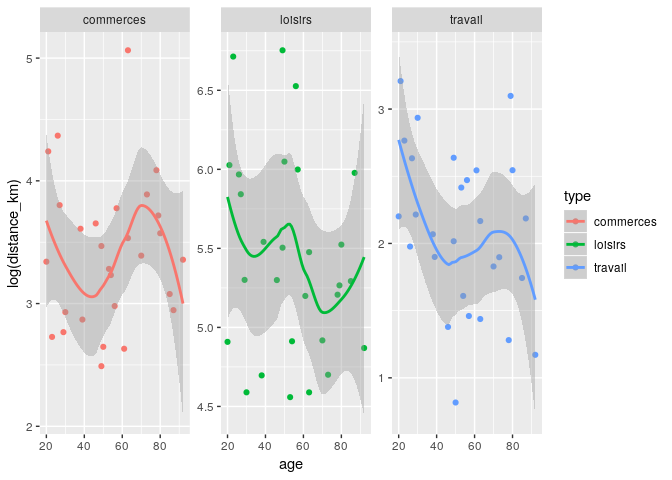

<!-- README.md is generated from README.Rmd. Please edit that file -->

[](http://www.repostatus.org/#wip)

# fakir

The goal of {fakir} is to provide fake datasets that can be used to
teach R.

## Characteristics

This package is designed for teaching data wrangling and data
visualisation:

  - some datasets follow the tidy-data principles, others don’t.
  - Some missing values are set for numeric and categorical variables
  - Some variables values are correlated

These datasets are suitable to introduce to the {tidyverse} and to
provide examples for main functions.  
Supported languages are, for now, French and US English.

## Examples

### Fake support ticket base :

  - All tickets

<!-- end list -->

``` r
library(fakir)
fake_ticket_client(vol = 10)
#> # A tibble: 10 x 25
#>    ref   num_client first last  job     age region id_dpt departement
#>    <chr> <chr>      <chr> <chr> <chr> <dbl> <chr>  <chr>  <chr>      
#>  1 DOSS… 31         Debi  Smith Film…    34 Rhône… 07     Ardèche    
#>  2 DOSS… 79         Josh… Murr… Cont…    40 Auver… 03     Allier     
#>  3 DOSS… 65         Dayne Mann  Educ…    18 Picar… 80     Somme      
#>  4 DOSS… 77         Carl… Goye… Poli…    38 Aquit… 47     Lot-et-Gar…
#>  5 DOSS… 59         Cole  Lemke Musi…    39 Prove… 83     Var        
#>  6 DOSS… 141        Betha Kuva… Adve…    30 Rhône… 69     Rhône      
#>  7 DOSS… 182        Mrs.  Kile… Yout…    19 Basse… 14     Calvados   
#>  8 DOSS… 69         Maxi… Sipes Engi…    27 Prove… 05     Hautes-Alp…
#>  9 DOSS… 120        Mari… Hoppe Cyto…    26 Prove… 05     Hautes-Alp…
#> 10 DOSS… 118        Mr.   Clem… Medi…    23 Champ… 10     Aube       
#> # … with 16 more variables: cb_provider <chr>, name <chr>,
#> #   entry_date <dttm>, fidelity_points <dbl>, priority_encoded <dbl>,
#> #   priority <fct>, timestamp <date>, year <dbl>, month <dbl>, day <int>,
#> #   supported <chr>, supported_encoded <int>, type <chr>,
#> #   type_encoded <int>, state <fct>, source_call <fct>
```

  - Separate tickets and client databases

<!-- end list -->

``` r
tickets_db <- fake_ticket_client(vol = 100, split = TRUE)
tickets_db
#> $clients
#> # A tibble: 200 x 14
#>    num_client first last  job     age region id_dpt departement cb_provider
#>  * <chr>      <chr> <chr> <chr> <dbl> <chr>  <chr>  <chr>       <chr>      
#>  1 1          Sere… Dool… Medi…    78 Midi-… 46     Lot         Diners Clu…
#>  2 2          Mrs.  Rich… Psyc…    34 <NA>   26     Drôme       Voyager    
#>  3 3          Dr.   Juli… Reta…    26 Centre 45     Loiret      Mastercard 
#>  4 4          Lucie Moen  Chie…    28 Midi-… 12     Aveyron     JCB 16 dig…
#>  5 5          Hake… Kiehn Scie…    66 Prove… 04     Alpes-de-H… VISA 16 di…
#>  6 6          Mrs.  Lemp… Buye…    20 Champ… 08     Ardennes    VISA 13 di…
#>  7 7          Marg… Rowe  Mark…    63 Poito… 17     Charente-M… Mastercard 
#>  8 8          Jarv… Purdy Phar…    40 Midi-… 65     Hautes-Pyr… VISA 16 di…
#>  9 9          Joan… Erns… Even…    48 Franc… 25     Doubs       JCB 16 dig…
#> 10 10         Ms.   Made… Stru…    44 Île-d… 92     Hauts-de-S… JCB 16 dig…
#> # … with 190 more rows, and 5 more variables: name <chr>,
#> #   entry_date <dttm>, fidelity_points <dbl>, priority_encoded <dbl>,
#> #   priority <fct>
#> 
#> $tickets
#> # A tibble: 100 x 10
#>    ref   num_client  year month   day timestamp  supported type  state
#>    <chr> <chr>      <dbl> <dbl> <int> <date>     <chr>     <chr> <fct>
#>  1 DOSS… 4           2015     2    13 2015-02-13 Non       <NA>  Term…
#>  2 DOSS… 6           2015     5     5 2015-05-05 Oui       <NA>  Inte…
#>  3 DOSS… 8           2016     3    19 2016-03-19 Non       Box   Inte…
#>  4 DOSS… 1           2016     3    20 2016-03-20 Non       Ligne Term…
#>  5 DOSS… 37          2016     7     7 2016-07-07 Non       Ligne En c…
#>  6 DOSS… 29          2016     7    21 2016-07-21 Non       Ligne Inte…
#>  7 DOSS… 37          2016     8    31 2016-08-31 Oui       Ligne Atte…
#>  8 DOSS… 1           2016    10    23 2016-10-23 Oui       <NA>  Term…
#>  9 DOSS… 9           2017     1    15 2017-01-15 Oui       Box   Term…
#> 10 DOSS… 24          2017     1    25 2017-01-25 Oui       Box   Atte…
#> # … with 90 more rows, and 1 more variable: source_call <fct>
ggplot(tickets_db$clients) +
  aes(entry_date, fidelity_points) +
  geom_point() +
  geom_smooth()
#> `geom_smooth()` using method = 'loess' and formula 'y ~ x'
```


``` r
ggplot(tickets_db$tickets) + aes(type) + geom_bar()
```


``` r
ggplot(tickets_db$tickets) + aes(state) + geom_bar()
```


### Fake website visits

``` r
fake_visits(from = "2017-01-01", to = "2017-01-31")
#> # A tibble: 31 x 8
#>    timestamp   year month   day  home about  blog contact
#>  * <date>     <dbl> <dbl> <int> <int> <int> <int>   <int>
#>  1 2017-01-01  2017     1     1   352   184   673     434
#>  2 2017-01-02  2017     1     2   203   147   567      NA
#>  3 2017-01-03  2017     1     3   103    81   499     453
#>  4 2017-01-04  2017     1     4   484   281   582     181
#>  5 2017-01-05  2017     1     5   438   190   663     385
#>  6 2017-01-06  2017     1     6   209   116   455     310
#>  7 2017-01-07  2017     1     7   439   138   364     369
#>  8 2017-01-08  2017     1     8   273   151   514     358
#>  9 2017-01-09  2017     1     9   316   164   322     273
#> 10 2017-01-10  2017     1    10   193   103    NA     261
#> # … with 21 more rows
```

### Fake questionnaire on mean of transport / goal

  - All answers

<!-- end list -->

``` r
fake_sondage_answers(n = 10)
#> # A tibble: 30 x 12
#>    id_individu   age sexe  region id_departement nom_departement
#>    <chr>       <int> <chr> <chr>  <chr>          <chr>          
#>  1 ID-OYCL-010    56 M     Rhône… 69             Rhône          
#>  2 ID-OYCL-010    56 M     Rhône… 69             Rhône          
#>  3 ID-OYCL-010    56 M     Rhône… 69             Rhône          
#>  4 ID-MXOJ-007    51 O     Centre 28             Eure-et-Loir   
#>  5 ID-MXOJ-007    51 O     Centre 28             Eure-et-Loir   
#>  6 ID-MXOJ-007    51 O     Centre 28             Eure-et-Loir   
#>  7 ID-OFNB-003    67 O     Île-d… 92             Hauts-de-Seine 
#>  8 ID-OFNB-003    67 O     Île-d… 92             Hauts-de-Seine 
#>  9 ID-OFNB-003    67 O     Île-d… 92             Hauts-de-Seine 
#> 10 ID-RMIX-009    35 F     Centre 37             Indre-et-Loire 
#> # … with 20 more rows, and 6 more variables: question_date <dttm>,
#> #   year <dbl>, type <chr>, distance_km <dbl>, transport <fct>,
#> #   temps_trajet_en_heures <dbl>
```

  - Separate individuals and their answers

<!-- end list -->

``` r
fake_sondage_answers(n = 10, split = TRUE)
#> $individus
#> # A tibble: 10 x 8
#>    id_individu   age sexe  region id_departement nom_departement
#>    <chr>       <int> <chr> <chr>  <chr>          <chr>          
#>  1 ID-OYCL-010    56 M     Auver… 63             Puy-de-Dôme    
#>  2 ID-MXOJ-007    51 O     Rhône… 69             Rhône          
#>  3 ID-OFNB-003    67 O     Basse… 50             Manche         
#>  4 ID-RMIX-009    35 F     Rhône… 38             Isère          
#>  5 ID-QGAW-001    44 M     Nord-… 62             Pas-de-Calais  
#>  6 ID-WILB-005    73 M     Lorra… 57             Moselle        
#>  7 ID-PDGN-006    90 F     Rhône… 38             Isère          
#>  8 ID-CJES-008    69 M     Aquit… 64             Pyrénées-Atlan…
#>  9 ID-VGUJ-002    30 F     Franc… 70             Haute-Saône    
#> 10 ID-ACYV-004    59 M     Corse  2A             Corse-du-Sud   
#> # … with 2 more variables: question_date <dttm>, year <dbl>
#> 
#> $answers
#> # A tibble: 30 x 5
#>    id_individu type      distance_km transport temps_trajet_en_heures
#>    <chr>       <chr>           <dbl> <fct>                      <dbl>
#>  1 ID-OYCL-010 travail          8.77 bus                         0.89
#>  2 ID-OYCL-010 commerces        6.92 mobylette                   0.91
#>  3 ID-OYCL-010 loisirs        395.   train                       0.79
#>  4 ID-MXOJ-007 travail         13.8  voiture                     0.16
#>  5 ID-MXOJ-007 commerces       31.7  voiture                     0.39
#>  6 ID-MXOJ-007 loisirs        242.   train                       0.48
#>  7 ID-OFNB-003 travail          2.01 velo                        0.36
#>  8 ID-OFNB-003 commerces       12.5  voiture                     0.15
#>  9 ID-OFNB-003 loisirs        376.   train                       0.75
#> 10 ID-RMIX-009 travail          7.90 mobylette                   0.95
#> # … with 20 more rows
```

### fake transport use

``` r
answers <- fake_sondage_answers(n = 30)
answers
#> # A tibble: 90 x 12
#>    id_individu   age sexe  region id_departement nom_departement
#>    <chr>       <int> <chr> <chr>  <chr>          <chr>          
#>  1 ID-XGRW-015    21 O     Prove… 06             Alpes-Maritimes
#>  2 ID-XGRW-015    21 O     Prove… 06             Alpes-Maritimes
#>  3 ID-XGRW-015    21 O     Prove… 06             Alpes-Maritimes
#>  4 ID-EUWP-022    NA O     Aquit… 64             Pyrénées-Atlan…
#>  5 ID-EUWP-022    NA O     Aquit… 64             Pyrénées-Atlan…
#>  6 ID-EUWP-022    NA O     Aquit… 64             Pyrénées-Atlan…
#>  7 ID-RAFQ-029    69 <NA>  Lorra… 54             Meurthe-et-Mos…
#>  8 ID-RAFQ-029    69 <NA>  Lorra… 54             Meurthe-et-Mos…
#>  9 ID-RAFQ-029    69 <NA>  Lorra… 54             Meurthe-et-Mos…
#> 10 ID-JIDO-016    93 <NA>  Aquit… 24             Dordogne       
#> # … with 80 more rows, and 6 more variables: question_date <dttm>,
#> #   year <dbl>, type <chr>, distance_km <dbl>, transport <fct>,
#> #   temps_trajet_en_heures <dbl>

ggplot(answers) + aes(age, log(distance_km), colour = type) + geom_point() +
  geom_smooth() + facet_wrap(~type, scales = "free_y")
#> `geom_smooth()` using method = 'loess' and formula 'y ~ x'
#> Warning: Removed 3 rows containing non-finite values (stat_smooth).
#> Warning: Removed 3 rows containing missing values (geom_point).
```



## Prior work

This package is heavily inspired by
[{charlatan}](https://github.com/ropensci/charlatan).

Scott Chamberlain (2017). charlatan: Make Fake Data. R package version
0.1.0. <https://CRAN.R-project.org/package=charlatan>

## Contribute

You can contribute to {fakir} in two ways:

### Translate

You can translate to other locales by providing :

  - new `vec` in “R/utils”
  - new `local` in “R/fake\_client” and “R/fake\_transport”

### New dataset

Feel free to create new datasets generators.

## COC

Please note that this project is released with a [Contributor Code of
Conduct](CODE_OF_CONDUCT.md). By participating in this project you agree
to abide by its terms.
