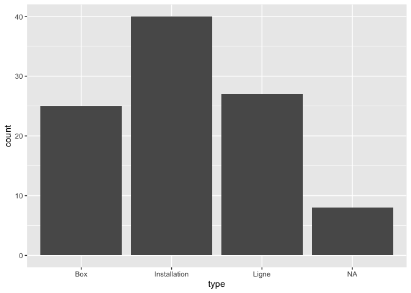
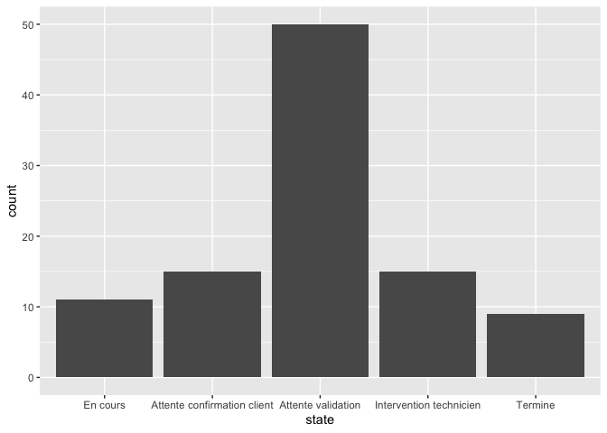
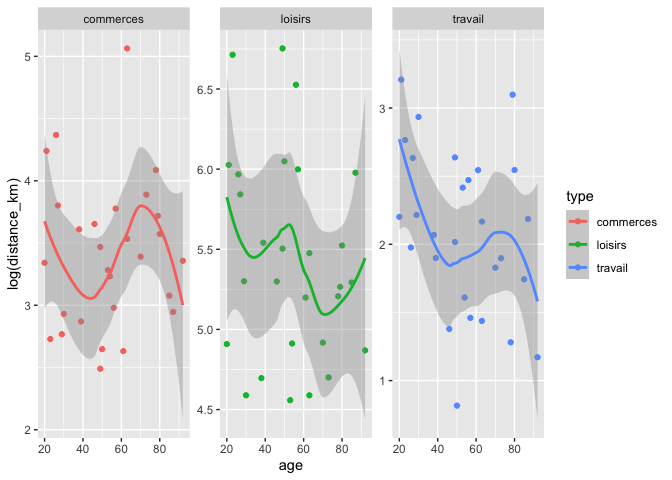

<!-- README.md is generated from README.Rmd. Please edit that file -->

# fakir 

<!-- badges: start -->

[](https://codecov.io/gh/ThinkR-open/fakir?branch=master)
[](https://github.com/ThinkR-open/fakir/actions/workflows/R-CMD-check.yaml)
[](https://lifecycle.r-lib.org/articles/stages.html#experimental)
[](https://lifecycle.r-lib.org/articles/stages.html#stable)
<!-- badges: end -->

The goal of `{fakir}` is to provide fake datasets that can be used to
teach R.

The full documentation is in this {pkgdown} site:
<https://thinkr-open.github.io/fakir/>

- Video presentation of `{fakir}` by [Abdul
  Majed](https://twitter.com/1littlecoder):
  <https://www.youtube.com/watch?v=EhhljL5zaWs>

## About

You’re reading the doc about version : 1.0.0

This README has been compiled on the

``` r
Sys.time()
```

    [1] "2023-03-27 21:31:11 CEST"

Here are the test & coverage results :

``` r
devtools::check(quiet = TRUE)
```

    ══ Documenting ═════════════════════════════════════════════════════════════════

    ── R CMD check results ──────────────────────────────────────── fakir 1.0.0 ────
    Duration: 28.5s

    0 errors ✔ | 0 warnings ✔ | 0 notes ✔

``` r
covr::package_coverage()
```

    fakir Coverage: 94.08%

    R/utils.R: 86.96%

    R/fake_transport.R: 88.61%

    R/fake_client.R: 92.97%

    R/fake_products.R: 100.00%

    R/fake_web.R: 100.00%

## Installation

``` r
# From r-universe.dev (No need for GITHUB_PAT)
install.packages(
  "fakir",
  repos = c("thinkropen" = "https://thinkr-open.r-universe.dev")
)

# With {remotes} using GitHub API
# install.packages("remotes")
remotes::install_github("ThinkR-open/fakir")
```

## Characteristics

This package is designed for teaching data wrangling and data
visualisation:

- some datasets follow the tidy-data principles, others don’t.
- Some missing values are set for numeric and categorical variables
- Some variables values are correlated

These datasets are suitable to introduce to the {tidyverse} and to
provide examples for main functions. Supported languages are, for now,
French and US English.

## Examples

### Fake support ticket base :

- All tickets

``` r
library(fakir)
library(ggplot2)
library(dplyr)
library(sf)
fake_ticket_client(vol = 10)
```

    # A tibble: 10 × 25
       ref           num_client first    last  job     age region id_dpt departement
       <chr>         <chr>      <chr>    <chr> <chr> <dbl> <chr>  <chr>  <chr>      
     1 DOSS-AMQN-002 79         Jovan    O'Ke… Gene…    22 Limou… 23     Creuse     
     2 DOSS-NCKJ-010 69         Miss     Lean… Emer…    68 Île-d… 75     Paris      
     3 DOSS-GPBE-009 120        Odell    Stok… Engi…    24 Nord-… 59     Nord       
     4 DOSS-GRLN-001 31         Loren    Lars… <NA>     NA Poito… 86     Vienne     
     5 DOSS-LEPJ-004 59         Maybelle Maye… Furt…    18 Limou… 23     Creuse     
     6 DOSS-DUCL-005 118        Jamarion Ober… Engi…    18 Pays … 53     Mayenne    
     7 DOSS-OCED-003 77         Lee      Scha… Admi…    NA Pays … 72     Sarthe     
     8 DOSS-KXSJ-007 65         Demetric Auer  Cont…    21 Aquit… 40     Landes     
     9 DOSS-UITD-006 141        Wilfrid  Harv… Educ…    53 Auver… 03     Allier     
    10 DOSS-SHKL-008 182        Addyson  Nien… Earl…    65 Poito… 86     Vienne     
    # ℹ 16 more variables: cb_provider <chr>, name <chr>, entry_date <dttm>,
    #   fidelity_points <dbl>, priority_encoded <dbl>, priority <fct>,
    #   timestamp <date>, year <dbl>, month <dbl>, day <int>, supported <chr>,
    #   supported_encoded <int>, type <chr>, type_encoded <int>, state <fct>,
    #   source_call <fct>

- Separate tickets and client databases

``` r
tickets_db <- fake_ticket_client(vol = 100, split = TRUE)
tickets_db
```

    $clients
    # A tibble: 200 × 14
       num_client first   last     job     age region id_dpt departement cb_provider
     * <chr>      <chr>   <chr>    <chr> <dbl> <chr>  <chr>  <chr>       <chr>      
     1 1          Solomon Heaney   Civi…    53 Champ… 08     Ardennes    Diners Clu…
     2 2          Karma   William… Scie…    81 Prove… 13     Bouches-du… VISA 13 di…
     3 3          Press   Kulas    Anim…    NA Prove… 05     Hautes-Alp… <NA>       
     4 4          Laken   McDermo… <NA>     NA Midi-… 12     Aveyron     <NA>       
     5 5          Sydnie  Jaskols… Hort…    30 Prove… 06     Alpes-Mari… <NA>       
     6 6          Clayton Runolfs… Comm…    NA Breta… 29     Finistère   Diners Clu…
     7 7          Roberta Purdy-W… Fina…    60 Nord-… 59     Nord        <NA>       
     8 8          Dr.     RonaldM… Astr…    30 <NA>   41     Loir-et-Ch… <NA>       
     9 9          Miss    Alondra… Occu…    18 <NA>   84     Vaucluse    Diners Clu…
    10 10         Vernice Ondrick… Clin…    19 Alsace 67     Bas-Rhin    <NA>       
    # ℹ 190 more rows
    # ℹ 5 more variables: name <chr>, entry_date <dttm>, fidelity_points <dbl>,
    #   priority_encoded <dbl>, priority <fct>

    $tickets
    # A tibble: 100 × 10
       ref            num_client  year month   day timestamp  supported type   state
       <chr>          <chr>      <dbl> <dbl> <int> <date>     <chr>     <chr>  <fct>
     1 DOSS-GFEL-0028 1           2016    12     5 2016-12-05 Non       Insta… Term…
     2 DOSS-UWYV-0016 22          2020     9    26 2020-09-26 Non       Insta… Atte…
     3 DOSS-DKFC-0073 9           2020    10    31 2020-10-31 Non       Insta… Term…
     4 DOSS-SAYJ-0047 8           2020    11    15 2020-11-15 Non       Box    Atte…
     5 DOSS-GSMZ-0080 30          2020    12     2 2020-12-02 Oui       Insta… Inte…
     6 DOSS-UIOZ-0085 10          2020    12    14 2020-12-14 Oui       Insta… Atte…
     7 DOSS-DSMI-0065 37          2021     1    11 2021-01-11 Non       Ligne  Atte…
     8 DOSS-JOYV-0029 37          2021     3     3 2021-03-03 Non       Box    Atte…
     9 DOSS-WPSG-0013 24          2021     3    10 2021-03-10 Non       <NA>   En c…
    10 DOSS-NHFG-0036 12          2021     3    27 2021-03-27 Non       Insta… Atte…
    # ℹ 90 more rows
    # ℹ 1 more variable: source_call <fct>

``` r
ggplot(tickets_db$clients) +
  aes(entry_date, fidelity_points) +
  geom_point() +
  geom_smooth()
```


``` r
ggplot(tickets_db$tickets) +
  aes(type) +
  geom_bar()
```



``` r
ggplot(tickets_db$tickets) +
  aes(state) +
  geom_bar()
```



- Join with internal {sf} spatial dataset

``` r
clients_map <- tickets_db$clients %>%
  group_by(id_dpt) %>%
  summarise(
    number_of_clients = n(),
    average_fidelity = mean(fidelity_points, na.rm = TRUE)
  ) %>%
  full_join(fra_sf, by = "id_dpt") %>%
  st_sf()

ggplot(clients_map) +
  geom_sf(aes(fill = average_fidelity)) +
  scale_fill_viridis_c() +
  coord_sf(
    crs = 2154,
    datum = 4326
  )
```


### Fake products

- Create a fake dataset of connected wearables

``` r
fake_products(10)
```

    # A tibble: 10 × 8
       name                 brand color price body_location category sent_from    id
       <chr>                <chr> <chr> <int> <chr>         <chr>    <chr>     <int>
     1 Step and Distance P… Lark… Pink      3 Waist         Industr… Taiwan        1
     2 Biking Tracker U Pr… Lark… Oliv…     5 Waist         Pets an… United S…     2
     3 Wearable Transmitte… Moen… Beige     4 Feet          Lifesty… Netherla…     3
     4 Multifunction Track… Weim… Yell…     5 Head          Lifesty… China         4
     5 Action Camera Pro    Blan… Mocc…    10 Brain         Lifesty… Italy         5
     6 Strapless Heart Rat… Mann… Deep…     4 Head          Medical  Finland       6
     7 Action Camera RE Pr… Mann… Maro…     5 Feet          Enterta… Finland       7
     8 Microcontroller ES   Moen… Pink      3 Neck          Fitness  Finland       8
     9 Microcontroller OGB… Moen… Plum      5 Arms          Awesome  France        9
    10 Wearable AUSG with … Moen… Dark…     9 Torso         Medical  Italy        10

### Fake website visits

``` r
fake_visits(from = "2017-01-01", to = "2017-01-31")
```

    # A tibble: 31 × 8
       timestamp   year month   day  home about  blog contact
     * <date>     <dbl> <dbl> <int> <int> <int> <int>   <int>
     1 2017-01-01  2017     1     1   369   220   404     210
     2 2017-01-02  2017     1     2   159   250   414     490
     3 2017-01-03  2017     1     3   436   170   498     456
     4 2017-01-04  2017     1     4    NA   258   526     392
     5 2017-01-05  2017     1     5   362    NA   407     291
     6 2017-01-06  2017     1     6   245   145   576      90
     7 2017-01-07  2017     1     7    NA    NA   484     167
     8 2017-01-08  2017     1     8   461   103   441      NA
     9 2017-01-09  2017     1     9   337   113   673     379
    10 2017-01-10  2017     1    10    NA   169   308     139
    # ℹ 21 more rows

### Fake questionnaire on mean of transport / goal

- All answers

``` r
fake_sondage_answers(n = 10)
```

    # A tibble: 30 × 12
       id_individu   age sexe  region    id_departement nom_departement
       <chr>       <int> <chr> <chr>     <chr>          <chr>          
     1 ID-NYDZ-010    NA <NA>  Aquitaine 24             Dordogne       
     2 ID-NYDZ-010    NA <NA>  Aquitaine 24             Dordogne       
     3 ID-NYDZ-010    NA <NA>  Aquitaine 24             Dordogne       
     4 ID-PWLB-009    71 F     Limousin  19             <NA>           
     5 ID-PWLB-009    71 F     Limousin  19             <NA>           
     6 ID-PWLB-009    71 F     Limousin  19             <NA>           
     7 ID-NMQG-001    42 M     <NA>      38             Isère          
     8 ID-NMQG-001    42 M     <NA>      38             Isère          
     9 ID-NMQG-001    42 M     <NA>      38             Isère          
    10 ID-RJXN-002    71 O     <NA>      42             Loire          
    # ℹ 20 more rows
    # ℹ 6 more variables: question_date <dttm>, year <dbl>, type <chr>,
    #   distance_km <dbl>, transport <fct>, temps_trajet_en_heures <dbl>

- Separate individuals and their answers

``` r
fake_sondage_answers(n = 10, split = TRUE)
```

    $individus
    # A tibble: 10 × 8
       id_individu   age sexe  region               id_departement nom_departement
       <chr>       <int> <chr> <chr>                <chr>          <chr>          
     1 ID-NYDZ-010    NA <NA>  Centre               36             Indre          
     2 ID-PWLB-009    71 F     Languedoc-Roussillon 11             Aude           
     3 ID-NMQG-001    42 M     Île-de-France        94             Val-de-Marne   
     4 ID-RJXN-002    71 O     Haute-Normandie      76             Seine-Maritime 
     5 ID-MROK-007    41 M     Rhône-Alpes          69             Rhône          
     6 ID-VMKS-004    33 O     Île-de-France        92             Hauts-de-Seine 
     7 ID-XEMZ-003    81 O     Rhône-Alpes          26             Drôme          
     8 ID-EUDQ-005    44 M     <NA>                 60             Oise           
     9 ID-DCIZ-008    92 O     Poitou-Charentes     17             <NA>           
    10 ID-KPUS-006    57 O     Île-de-France        94             Val-de-Marne   
    # ℹ 2 more variables: question_date <dttm>, year <dbl>

    $answers
    # A tibble: 30 × 5
       id_individu type      distance_km transport temps_trajet_en_heures
       <chr>       <chr>           <dbl> <fct>                      <dbl>
     1 ID-NYDZ-010 travail         12.2  voiture                     0.15
     2 ID-NYDZ-010 commerces        9.61 bus                         1.01
     3 ID-NYDZ-010 loisirs        549.   avion                       0.27
     4 ID-PWLB-009 travail         11.9  voiture                     0.14
     5 ID-PWLB-009 commerces       27.4  voiture                     0.34
     6 ID-PWLB-009 loisirs        210.   train                       0.42
     7 ID-NMQG-001 travail          2.38 velo                        0.43
     8 ID-NMQG-001 commerces       14.9  voiture                     0.18
     9 ID-NMQG-001 loisirs        446.   train                       0.89
    10 ID-RJXN-002 travail          6.18 mobylette                   0.75
    # ℹ 20 more rows

### fake transport use

``` r
answers <- fake_sondage_answers(n = 30)
answers
```

    # A tibble: 90 × 12
       id_individu   age sexe  region           id_departement nom_departement
       <chr>       <int> <chr> <chr>            <chr>          <chr>          
     1 ID-MROK-007    NA M     Pays de la Loire 72             Sarthe         
     2 ID-MROK-007    NA M     Pays de la Loire 72             Sarthe         
     3 ID-MROK-007    NA M     Pays de la Loire 72             Sarthe         
     4 ID-NYDZ-010    49 M     <NA>             80             Somme          
     5 ID-NYDZ-010    49 M     <NA>             80             Somme          
     6 ID-NYDZ-010    49 M     <NA>             80             Somme          
     7 ID-HXOG-015    50 M     Bretagne         22             Côtes-d'Armor  
     8 ID-HXOG-015    50 M     Bretagne         22             Côtes-d'Armor  
     9 ID-HXOG-015    50 M     Bretagne         22             Côtes-d'Armor  
    10 ID-MZNB-024    70 F     Bourgogne        21             Côte-d'Or      
    # ℹ 80 more rows
    # ℹ 6 more variables: question_date <dttm>, year <dbl>, type <chr>,
    #   distance_km <dbl>, transport <fct>, temps_trajet_en_heures <dbl>

``` r
ggplot(answers) +
  aes(age, log(distance_km), colour = type) +
  geom_point() +
  geom_smooth() +
  facet_wrap(~type, scales = "free_y")
```

    Warning: Removed 6 rows containing non-finite values (`stat_smooth()`).

    Warning: Removed 6 rows containing missing values (`geom_point()`).



## Prior work

This package is heavily inspired by
[{charlatan}](https://github.com/ropensci/charlatan).

Scott Chamberlain (2017). charlatan: Make Fake Data. R package version
0.1.0. <https://CRAN.R-project.org/package=charlatan>

## Contribute

You can contribute to `{fakir}` in two ways:

### Translate

You can translate to other locales by providing :

- new `vec` in “R/utils”
- new `local` in “R/fake_client” and “R/fake_transport”

### New dataset

Feel free to create new datasets generators.

## COC

Please note that this project is released with a [Contributor Code of
Conduct](CODE_OF_CONDUCT.md). By participating in this project you agree
to abide by its terms.
