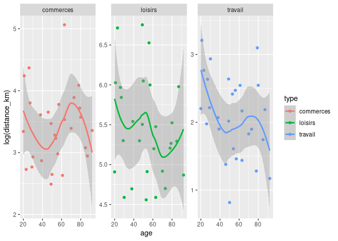

<!-- README.md is generated from README.Rmd. Please edit that file -->

# fakir 

<!-- badges: start -->

[](http://www.repostatus.org/#wip)
[](https://github.com/ThinkR-open/fakir/actions)
[](https://codecov.io/gh/ThinkR-open/fakir?branch=master)
<!-- badges: end -->

The goal of {fakir} is to provide fake datasets that can be used to
teach R.

The full documentation is in this {pkgdown} site:
<https://thinkr-open.github.io/fakir/>

-   Video presentation of {fakir} by [Abdul
    Majed](https://twitter.com/1littlecoder):
    <https://www.youtube.com/watch?v=EhhljL5zaWs>

## Installation

``` r
# From r-universe.dev (No need for GITHUB_PAT)
install.packages("fakir", 
                 repos = c("thinkropen" = "https://thinkr-open.r-universe.dev"))

# With {remotes} using GitHub API
# install.packages("remotes")
remotes::install_github("ThinkR-open/fakir")
```

## Characteristics

This package is designed for teaching data wrangling and data
visualisation:

-   some datasets follow the tidy-data principles, others don’t.
-   Some missing values are set for numeric and categorical variables
-   Some variables values are correlated

These datasets are suitable to introduce to the {tidyverse} and to
provide examples for main functions.  
Supported languages are, for now, French and US English.

## Examples

### Fake support ticket base :

-   All tickets

``` r
library(fakir)
fake_ticket_client(vol = 10)
#> # A tibble: 10 × 25
#>    ref           num_client first    last  job     age region id_dpt departement
#>    <chr>         <chr>      <chr>    <chr> <chr> <dbl> <chr>  <chr>  <chr>      
#>  1 DOSS-AMQN-002 79         Jovan    O'Ke… Gene…    22 Langu… 30     Gard       
#>  2 DOSS-NCKJ-010 69         Miss     Lean… Emer…    68 Île-d… 78     Yvelines   
#>  3 DOSS-GPBE-009 120        Odell    Stok… Engi…    24 Auver… 15     Cantal     
#>  4 DOSS-GRLN-001 31         Loren    Lars… <NA>     NA Midi-… 81     Tarn       
#>  5 DOSS-LEPJ-004 59         Maybelle Maye… Furt…    18 Franc… 70     Haute-Saône
#>  6 DOSS-DUCL-005 118        Jamarion Ober… Engi…    18 Breta… 22     Côtes-d'Ar…
#>  7 DOSS-OCED-003 77         Lee      Scha… Admi…    NA Corse  2A     Corse-du-S…
#>  8 DOSS-KXSJ-007 65         Demetric Auer  Cont…    21 Bourg… 71     Saône-et-L…
#>  9 DOSS-UITD-006 141        Wilfrid  Harv… Educ…    53 Prove… 13     Bouches-du…
#> 10 DOSS-SHKL-008 182        Addyson  Nien… Earl…    65 Bourg… 21     <NA>       
#> # … with 16 more variables: cb_provider <chr>, name <chr>, entry_date <dttm>,
#> #   fidelity_points <dbl>, priority_encoded <dbl>, priority <fct>,
#> #   timestamp <date>, year <dbl>, month <dbl>, day <int>, supported <chr>,
#> #   supported_encoded <int>, type <chr>, type_encoded <int>, state <fct>,
#> #   source_call <fct>
```

-   Separate tickets and client databases

``` r
tickets_db <- fake_ticket_client(vol = 100, split = TRUE)
tickets_db
#> $clients
#> # A tibble: 200 × 14
#>    num_client first   last   job      age region  id_dpt departement cb_provider
#>  * <chr>      <chr>   <chr>  <chr>  <dbl> <chr>   <chr>  <chr>       <chr>      
#>  1 1          Solomon Heaney Civil…    53 Rhône-… 73     Savoie      Diners Clu…
#>  2 2          Karma   Willi… Scien…    81 Centre  41     Loir-et-Ch… VISA 13 di…
#>  3 3          Press   Kulas  Anima…    NA <NA>    01     Ain         <NA>       
#>  4 4          Laken   McDer… <NA>      NA Centre  18     Cher        <NA>       
#>  5 5          Sydnie  Jasko… Horti…    30 Basse-… 50     <NA>        <NA>       
#>  6 6          Clayton Runol… Commi…    NA Bretag… 56     Morbihan    Diners Clu…
#>  7 7          Roberta Purdy… Finan…    60 <NA>    69     Rhône       <NA>       
#>  8 8          Dr.     Ronal… Astro…    30 Langue… 48     Lozère      <NA>       
#>  9 9          Miss    Alond… Occup…    18 Franch… 25     Doubs       Diners Clu…
#> 10 10         Vernice Ondri… Clini…    19 Bourgo… 58     Nièvre      <NA>       
#> # … with 190 more rows, and 5 more variables: name <chr>, entry_date <dttm>,
#> #   fidelity_points <dbl>, priority_encoded <dbl>, priority <fct>
#> 
#> $tickets
#> # A tibble: 100 × 10
#>    ref            num_client  year month   day timestamp  supported type   state
#>    <chr>          <chr>      <dbl> <dbl> <int> <date>     <chr>     <chr>  <fct>
#>  1 DOSS-GFEL-0028 1           2015    11    27 2015-11-27 Non       Insta… Term…
#>  2 DOSS-UWYV-0016 22          2019     9    18 2019-09-18 Non       Insta… Atte…
#>  3 DOSS-DKFC-0073 9           2019    10    23 2019-10-23 Non       Insta… Term…
#>  4 DOSS-SAYJ-0047 8           2019    11     7 2019-11-07 Non       Box    Atte…
#>  5 DOSS-GSMZ-0080 30          2019    11    24 2019-11-24 Oui       Insta… Inte…
#>  6 DOSS-UIOZ-0085 10          2019    12     6 2019-12-06 Oui       Insta… Atte…
#>  7 DOSS-DSMI-0065 37          2020     1     3 2020-01-03 Non       Ligne  Atte…
#>  8 DOSS-JOYV-0029 37          2020     2    23 2020-02-23 Non       Box    Atte…
#>  9 DOSS-WPSG-0013 24          2020     3     1 2020-03-01 Non       <NA>   En c…
#> 10 DOSS-NHFG-0036 12          2020     3    18 2020-03-18 Non       Insta… Atte…
#> # … with 90 more rows, and 1 more variable: source_call <fct>
ggplot(tickets_db$clients) +
  aes(entry_date, fidelity_points) +
  geom_point() +
  geom_smooth()
```


``` r
ggplot(tickets_db$tickets) + aes(type) + geom_bar()
```


``` r
ggplot(tickets_db$tickets) + aes(state) + geom_bar()
```


-   Join with internal {sf} spatial dataset

``` r
clients_map <- tickets_db$clients %>% 
  group_by(id_dpt) %>% 
  summarise(
    number_of_clients = n(),
    average_fidelity = mean(fidelity_points, na.rm = TRUE)
  ) %>% 
  full_join(fra_sf, by = "id_dpt") %>% 
  st_sf()

ggplot(clients_map) +
  geom_sf(aes(fill = average_fidelity)) +
  scale_fill_viridis_c() +
  coord_sf(
    crs = 2154,
    datum = 4326
  )
```


### Fake products

-   Create a fake dataset of connected wearables

``` r
fake_products(10)
#> # A tibble: 10 × 8
#>    name          brand     color   price body_location category  sent_from    id
#>    <chr>         <chr>     <chr>   <int> <chr>         <chr>     <chr>     <int>
#>  1 Step and Dis… Larkin, … Pink        3 Waist         Industri… Taiwan        1
#>  2 Biking Track… Larkin, … OliveD…     5 Waist         Pets and… United S…     2
#>  3 Wearable Tra… Moen, Mo… Beige       4 Feet          Lifestyle Netherla…     3
#>  4 Multifunctio… Weimann,… Yellow…     5 Head          Lifestyle China         4
#>  5 Action Camer… Blanda, … Moccas…    10 Brain         Lifestyle Italy         5
#>  6 Strapless He… Mann and… DeepPi…     4 Head          Medical   Finland       6
#>  7 Action Camer… Mann and… Maroon      5 Feet          Entertai… Finland       7
#>  8 Microcontrol… Moen, Mo… Pink        3 Neck          Fitness   Finland       8
#>  9 Microcontrol… Moen, Mo… Plum        5 Arms          Awesome   France        9
#> 10 Wearable AUS… Moen, Mo… DarkRed     9 Torso         Medical   Italy        10
```

### Fake website visits

``` r
fake_visits(from = "2017-01-01", to = "2017-01-31")
#> # A tibble: 31 × 8
#>    timestamp   year month   day  home about  blog contact
#>  * <date>     <dbl> <dbl> <int> <int> <int> <int>   <int>
#>  1 2017-01-01  2017     1     1   369   220   404     210
#>  2 2017-01-02  2017     1     2   159   250   414     490
#>  3 2017-01-03  2017     1     3   436   170   498     456
#>  4 2017-01-04  2017     1     4    NA   258   526     392
#>  5 2017-01-05  2017     1     5   362    NA   407     291
#>  6 2017-01-06  2017     1     6   245   145   576      90
#>  7 2017-01-07  2017     1     7    NA    NA   484     167
#>  8 2017-01-08  2017     1     8   461   103   441      NA
#>  9 2017-01-09  2017     1     9   337   113   673     379
#> 10 2017-01-10  2017     1    10    NA   169   308     139
#> # … with 21 more rows
```

### Fake questionnaire on mean of transport / goal

-   All answers

``` r
fake_sondage_answers(n = 10)
#> # A tibble: 30 × 12
#>    id_individu   age sexe  region           id_departement nom_departement
#>    <chr>       <int> <chr> <chr>            <chr>          <chr>          
#>  1 ID-NYDZ-010    NA <NA>  Corse            2A             Corse-du-Sud   
#>  2 ID-NYDZ-010    NA <NA>  Corse            2A             Corse-du-Sud   
#>  3 ID-NYDZ-010    NA <NA>  Corse            2A             Corse-du-Sud   
#>  4 ID-PWLB-009    71 F     Basse-Normandie  14             Calvados       
#>  5 ID-PWLB-009    71 F     Basse-Normandie  14             Calvados       
#>  6 ID-PWLB-009    71 F     Basse-Normandie  14             Calvados       
#>  7 ID-NMQG-001    42 M     Poitou-Charentes 86             <NA>           
#>  8 ID-NMQG-001    42 M     Poitou-Charentes 86             <NA>           
#>  9 ID-NMQG-001    42 M     Poitou-Charentes 86             <NA>           
#> 10 ID-RJXN-002    71 O     Auvergne         15             Cantal         
#> # … with 20 more rows, and 6 more variables: question_date <dttm>, year <dbl>,
#> #   type <chr>, distance_km <dbl>, transport <fct>,
#> #   temps_trajet_en_heures <dbl>
```

-   Separate individuals and their answers

``` r
fake_sondage_answers(n = 10, split = TRUE)
#> $individus
#> # A tibble: 10 × 8
#>    id_individu   age sexe  region               id_departement nom_departement
#>    <chr>       <int> <chr> <chr>                <chr>          <chr>          
#>  1 ID-NYDZ-010    NA <NA>  Pays de la Loire     49             Maine-et-Loire 
#>  2 ID-PWLB-009    71 F     Basse-Normandie      14             Calvados       
#>  3 ID-NMQG-001    42 M     Bourgogne            58             Nièvre         
#>  4 ID-RJXN-002    71 O     Centre               41             Loir-et-Cher   
#>  5 ID-MROK-007    41 M     Languedoc-Roussillon 48             Lozère         
#>  6 ID-VMKS-004    33 O     Poitou-Charentes     86             Vienne         
#>  7 ID-XEMZ-003    81 O     <NA>                 77             Seine-et-Marne 
#>  8 ID-EUDQ-005    44 M     Champagne-Ardenne    51             <NA>           
#>  9 ID-DCIZ-008    92 O     Picardie             60             Oise           
#> 10 ID-KPUS-006    57 O     Picardie             60             Oise           
#> # … with 2 more variables: question_date <dttm>, year <dbl>
#> 
#> $answers
#> # A tibble: 30 × 5
#>    id_individu type      distance_km transport temps_trajet_en_heures
#>    <chr>       <chr>           <dbl> <fct>                      <dbl>
#>  1 ID-NYDZ-010 travail         12.2  voiture                     0.15
#>  2 ID-NYDZ-010 commerces        9.61 bus                         1.01
#>  3 ID-NYDZ-010 loisirs        549.   avion                       0.27
#>  4 ID-PWLB-009 travail         11.9  voiture                     0.14
#>  5 ID-PWLB-009 commerces       27.4  voiture                     0.34
#>  6 ID-PWLB-009 loisirs        210.   train                       0.42
#>  7 ID-NMQG-001 travail          2.38 velo                        0.43
#>  8 ID-NMQG-001 commerces       14.9  voiture                     0.18
#>  9 ID-NMQG-001 loisirs        446.   train                       0.89
#> 10 ID-RJXN-002 travail          6.18 mobylette                   0.75
#> # … with 20 more rows
```

### fake transport use

``` r
answers <- fake_sondage_answers(n = 30)
answers
#> # A tibble: 90 × 12
#>    id_individu   age sexe  region      id_departement nom_departement
#>    <chr>       <int> <chr> <chr>       <chr>          <chr>          
#>  1 ID-MROK-007    NA M     <NA>        16             <NA>           
#>  2 ID-MROK-007    NA M     <NA>        16             <NA>           
#>  3 ID-MROK-007    NA M     <NA>        16             <NA>           
#>  4 ID-NYDZ-010    49 M     Rhône-Alpes 07             Ardèche        
#>  5 ID-NYDZ-010    49 M     Rhône-Alpes 07             Ardèche        
#>  6 ID-NYDZ-010    49 M     Rhône-Alpes 07             Ardèche        
#>  7 ID-HXOG-015    50 M     <NA>        39             Jura           
#>  8 ID-HXOG-015    50 M     <NA>        39             Jura           
#>  9 ID-HXOG-015    50 M     <NA>        39             Jura           
#> 10 ID-MZNB-024    70 F     <NA>        51             Marne          
#> # … with 80 more rows, and 6 more variables: question_date <dttm>, year <dbl>,
#> #   type <chr>, distance_km <dbl>, transport <fct>,
#> #   temps_trajet_en_heures <dbl>

ggplot(answers) + aes(age, log(distance_km), colour = type) + geom_point() +
  geom_smooth() + facet_wrap(~type, scales = "free_y")
#> Warning: Removed 6 rows containing non-finite values (stat_smooth).
#> Warning: Removed 6 rows containing missing values (geom_point).
```



## Prior work

This package is heavily inspired by
[{charlatan}](https://github.com/ropensci/charlatan).

Scott Chamberlain (2017). charlatan: Make Fake Data. R package version
0.1.0. <https://CRAN.R-project.org/package=charlatan>

## Contribute

You can contribute to {fakir} in two ways:

### Translate

You can translate to other locales by providing :

-   new `vec` in “R/utils”
-   new `local` in “R/fake_client” and “R/fake_transport”

### New dataset

Feel free to create new datasets generators.

## COC

Please note that this project is released with a [Contributor Code of
Conduct](CODE_OF_CONDUCT.md). By participating in this project you agree
to abide by its terms.
