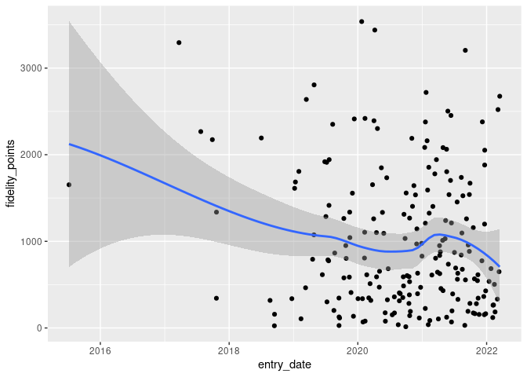
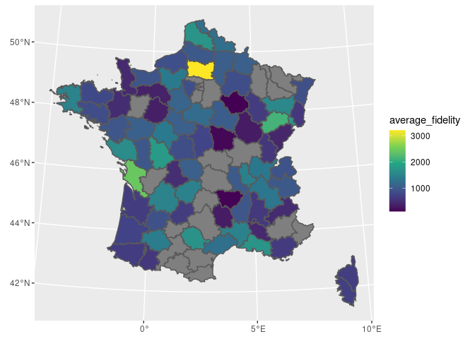

<!-- README.md is generated from README.Rmd. Please edit that file -->

# fakir 

<!-- badges: start -->

[](http://www.repostatus.org/#wip)
[](https://travis-ci.org/ThinkR-open/fakir)
[](https://ci.appveyor.com/project/ThinkR-open/fakir)
[](https://codecov.io/gh/ThinkR-open/fakir?branch=master)
<!-- badges: end -->

The goal of {fakir} is to provide fake datasets that can be used to
teach R.

The full documentation is in this {pkgdown} site:
<https://thinkr-open.github.io/fakir/>

  - Video presentation of {fakir} by [Abdul
    Majed](https://twitter.com/1littlecoder):
    <https://www.youtube.com/watch?v=EhhljL5zaWs>

## Characteristics

This package is designed for teaching data wrangling and data
visualisation:

  - some datasets follow the tidy-data principles, others don’t.
  - Some missing values are set for numeric and categorical variables
  - Some variables values are correlated

These datasets are suitable to introduce to the {tidyverse} and to
provide examples for main functions.  
Supported languages are, for now, French and US English.

## Examples

### Fake support ticket base :

  - All tickets

<!-- end list -->

``` r
library(fakir)
fake_ticket_client(vol = 10)
#> # A tibble: 10 x 25
#>    ref   num_client first last  job     age region id_dpt departement
#>    <chr> <chr>      <chr> <chr> <chr> <dbl> <chr>  <chr>  <chr>      
#>  1 DOSS… 79         Jovan O'Ke… Gene…    22 <NA>   83     Var        
#>  2 DOSS… 69         Miss  Lean… Emer…    68 Prove… 04     Alpes-de-H…
#>  3 DOSS… 120        Odell Stok… Engi…    24 Breta… 29     Finistère  
#>  4 DOSS… 31         Loren Lars… <NA>     NA Bourg… 71     Saône-et-L…
#>  5 DOSS… 59         Mayb… Maye… Furt…    18 Midi-… 31     Haute-Garo…
#>  6 DOSS… 118        Jama… Ober… Engi…    18 <NA>   51     Marne      
#>  7 DOSS… 77         Lee   Scha… Admi…    NA Nord-… 59     Nord       
#>  8 DOSS… 65         Deme… Auer  Cont…    21 Prove… 05     Hautes-Alp…
#>  9 DOSS… 141        Wilf… Harv… Educ…    53 Prove… 83     <NA>       
#> 10 DOSS… 182        Addy… Nien… Earl…    65 <NA>   46     Lot        
#> # … with 16 more variables: cb_provider <chr>, name <chr>, entry_date <dttm>,
#> #   fidelity_points <dbl>, priority_encoded <dbl>, priority <fct>,
#> #   timestamp <date>, year <dbl>, month <dbl>, day <int>, supported <chr>,
#> #   supported_encoded <int>, type <chr>, type_encoded <int>, state <fct>,
#> #   source_call <fct>
```

  - Separate tickets and client databases

<!-- end list -->

``` r
tickets_db <- fake_ticket_client(vol = 100, split = TRUE)
tickets_db
#> $clients
#> # A tibble: 200 x 14
#>    num_client first last  job     age region id_dpt departement cb_provider
#>  * <chr>      <chr> <chr> <chr> <dbl> <chr>  <chr>  <chr>       <chr>      
#>  1 1          Solo… Hean… Civi…    53 Franc… 90     Territoire… Diners Clu…
#>  2 2          Karma Will… Scie…    81 Midi-… 81     Tarn        VISA 13 di…
#>  3 3          Press Kulas Anim…    NA Poito… 86     Vienne      <NA>       
#>  4 4          Laken McDe… <NA>     NA Basse… 61     <NA>        <NA>       
#>  5 5          Sydn… Jask… Hort…    30 Centre 37     <NA>        <NA>       
#>  6 6          Clay… Runo… Comm…    NA Île-d… 95     Val-d'Oise  Diners Clu…
#>  7 7          Robe… Purd… Fina…    60 Haute… 27     <NA>        <NA>       
#>  8 8          Dr.   Rona… Astr…    30 Prove… 06     <NA>        <NA>       
#>  9 9          Miss  Alon… Occu…    18 <NA>   72     Sarthe      Diners Clu…
#> 10 10         Vern… Ondr… Clin…    19 Midi-… 82     Tarn-et-Ga… <NA>       
#> # … with 190 more rows, and 5 more variables: name <chr>, entry_date <dttm>,
#> #   fidelity_points <dbl>, priority_encoded <dbl>, priority <fct>
#> 
#> $tickets
#> # A tibble: 100 x 10
#>    ref   num_client  year month   day timestamp  supported type  state
#>    <chr> <chr>      <dbl> <dbl> <int> <date>     <chr>     <chr> <fct>
#>  1 DOSS… 1           2014     2    15 2014-02-15 Non       Inst… Term…
#>  2 DOSS… 22          2017    12     7 2017-12-07 Non       Inst… Atte…
#>  3 DOSS… 9           2018     1    11 2018-01-11 Non       Inst… Term…
#>  4 DOSS… 8           2018     1    25 2018-01-25 Non       Box   Atte…
#>  5 DOSS… 30          2018     2    12 2018-02-12 Oui       Inst… Inte…
#>  6 DOSS… 10          2018     2    24 2018-02-24 Oui       Inst… Atte…
#>  7 DOSS… 37          2018     3    24 2018-03-24 Non       Ligne Atte…
#>  8 DOSS… 37          2018     5    14 2018-05-14 Non       Box   Atte…
#>  9 DOSS… 24          2018     5    21 2018-05-21 Non       <NA>  En c…
#> 10 DOSS… 12          2018     6     7 2018-06-07 Non       Inst… Atte…
#> # … with 90 more rows, and 1 more variable: source_call <fct>
ggplot(tickets_db$clients) +
  aes(entry_date, fidelity_points) +
  geom_point() +
  geom_smooth()
```



``` r
ggplot(tickets_db$tickets) + aes(type) + geom_bar()
```


``` r
ggplot(tickets_db$tickets) + aes(state) + geom_bar()
```


  - Join with internal {sf} spatial dataset

<!-- end list -->

``` r
clients_map <- tickets_db$clients %>% 
  group_by(id_dpt) %>% 
  summarise(
    number_of_clients = n(),
    average_fidelity = mean(fidelity_points, na.rm = TRUE)
  ) %>% 
  full_join(fra_sf, by = "id_dpt") %>% 
  st_sf()

ggplot(clients_map) +
  geom_sf(aes(fill = average_fidelity)) +
  scale_fill_viridis_c() +
  coord_sf(
    crs = 2154,
    datum = 4326
  )
```



### Fake website visits

``` r
fake_visits(from = "2017-01-01", to = "2017-01-31")
#> # A tibble: 31 x 8
#>    timestamp   year month   day  home about  blog contact
#>  * <date>     <dbl> <dbl> <int> <int> <int> <int>   <int>
#>  1 2017-01-01  2017     1     1   369   220   404     210
#>  2 2017-01-02  2017     1     2   159   250   414     490
#>  3 2017-01-03  2017     1     3   436   170   498     456
#>  4 2017-01-04  2017     1     4    NA   258   526     392
#>  5 2017-01-05  2017     1     5   362    NA   407     291
#>  6 2017-01-06  2017     1     6   245   145   576      90
#>  7 2017-01-07  2017     1     7    NA    NA   484     167
#>  8 2017-01-08  2017     1     8   461   103   441      NA
#>  9 2017-01-09  2017     1     9   337   113   673     379
#> 10 2017-01-10  2017     1    10    NA   169   308     139
#> # … with 21 more rows
```

### Fake questionnaire on mean of transport / goal

  - All answers

<!-- end list -->

``` r
fake_sondage_answers(n = 10)
#> # A tibble: 30 x 12
#>    id_individu   age sexe  region id_departement nom_departement
#>    <chr>       <int> <chr> <chr>  <chr>          <chr>          
#>  1 ID-NYDZ-010    NA <NA>  Rhône… 38             Isère          
#>  2 ID-NYDZ-010    NA <NA>  Rhône… 38             Isère          
#>  3 ID-NYDZ-010    NA <NA>  Rhône… 38             Isère          
#>  4 ID-PWLB-009    71 F     Picar… 60             Oise           
#>  5 ID-PWLB-009    71 F     Picar… 60             Oise           
#>  6 ID-PWLB-009    71 F     Picar… 60             Oise           
#>  7 ID-NMQG-001    42 M     Langu… 11             Aude           
#>  8 ID-NMQG-001    42 M     Langu… 11             Aude           
#>  9 ID-NMQG-001    42 M     Langu… 11             Aude           
#> 10 ID-RJXN-002    71 O     Pays … 44             Loire-Atlantiq…
#> # … with 20 more rows, and 6 more variables: question_date <dttm>, year <dbl>,
#> #   type <chr>, distance_km <dbl>, transport <fct>,
#> #   temps_trajet_en_heures <dbl>
```

  - Separate individuals and their answers

<!-- end list -->

``` r
fake_sondage_answers(n = 10, split = TRUE)
#> $individus
#> # A tibble: 10 x 8
#>    id_individu   age sexe  region id_departement nom_departement
#>    <chr>       <int> <chr> <chr>  <chr>          <chr>          
#>  1 ID-NYDZ-010    NA <NA>  Auver… 43             <NA>           
#>  2 ID-PWLB-009    71 F     Lorra… 88             Vosges         
#>  3 ID-NMQG-001    42 M     Lorra… 54             Meurthe-et-Mos…
#>  4 ID-RJXN-002    71 O     Auver… 43             Haute-Loire    
#>  5 ID-MROK-007    41 M     Auver… 15             Cantal         
#>  6 ID-VMKS-004    33 O     Pays … 85             Vendée         
#>  7 ID-XEMZ-003    81 O     Basse… 61             Orne           
#>  8 ID-EUDQ-005    44 M     Bourg… 71             Saône-et-Loire 
#>  9 ID-DCIZ-008    92 O     <NA>   88             Vosges         
#> 10 ID-KPUS-006    57 O     Poito… 17             Charente-Marit…
#> # … with 2 more variables: question_date <dttm>, year <dbl>
#> 
#> $answers
#> # A tibble: 30 x 5
#>    id_individu type      distance_km transport temps_trajet_en_heures
#>    <chr>       <chr>           <dbl> <fct>                      <dbl>
#>  1 ID-NYDZ-010 travail         12.2  voiture                     0.15
#>  2 ID-NYDZ-010 commerces        9.61 bus                         1.01
#>  3 ID-NYDZ-010 loisirs        549.   avion                       0.27
#>  4 ID-PWLB-009 travail         11.9  voiture                     0.14
#>  5 ID-PWLB-009 commerces       27.4  voiture                     0.34
#>  6 ID-PWLB-009 loisirs        210.   train                       0.42
#>  7 ID-NMQG-001 travail          2.38 velo                        0.43
#>  8 ID-NMQG-001 commerces       14.9  voiture                     0.18
#>  9 ID-NMQG-001 loisirs        446.   train                       0.89
#> 10 ID-RJXN-002 travail          6.18 mobylette                   0.75
#> # … with 20 more rows
```

### fake transport use

``` r
answers <- fake_sondage_answers(n = 30)
answers
#> # A tibble: 90 x 12
#>    id_individu   age sexe  region id_departement nom_departement
#>    <chr>       <int> <chr> <chr>  <chr>          <chr>          
#>  1 ID-MROK-007    NA M     Limou… 87             Haute-Vienne   
#>  2 ID-MROK-007    NA M     Limou… 87             Haute-Vienne   
#>  3 ID-MROK-007    NA M     Limou… 87             Haute-Vienne   
#>  4 ID-NYDZ-010    49 M     Prove… 04             Alpes-de-Haute…
#>  5 ID-NYDZ-010    49 M     Prove… 04             Alpes-de-Haute…
#>  6 ID-NYDZ-010    49 M     Prove… 04             Alpes-de-Haute…
#>  7 ID-HXOG-015    50 M     Langu… 48             Lozère         
#>  8 ID-HXOG-015    50 M     Langu… 48             Lozère         
#>  9 ID-HXOG-015    50 M     Langu… 48             Lozère         
#> 10 ID-MZNB-024    70 F     Bourg… 71             Saône-et-Loire 
#> # … with 80 more rows, and 6 more variables: question_date <dttm>, year <dbl>,
#> #   type <chr>, distance_km <dbl>, transport <fct>,
#> #   temps_trajet_en_heures <dbl>

ggplot(answers) + aes(age, log(distance_km), colour = type) + geom_point() +
  geom_smooth() + facet_wrap(~type, scales = "free_y")
#> Warning: Removed 6 rows containing non-finite values (stat_smooth).
#> Warning: Removed 6 rows containing missing values (geom_point).
```


## Prior work

This package is heavily inspired by
[{charlatan}](https://github.com/ropensci/charlatan).

Scott Chamberlain (2017). charlatan: Make Fake Data. R package version
0.1.0. <https://CRAN.R-project.org/package=charlatan>

## Contribute

You can contribute to {fakir} in two ways:

### Translate

You can translate to other locales by providing :

  - new `vec` in “R/utils”
  - new `local` in “R/fake\_client” and “R/fake\_transport”

### New dataset

Feel free to create new datasets generators.

## COC

Please note that this project is released with a [Contributor Code of
Conduct](CODE_OF_CONDUCT.md). By participating in this project you agree
to abide by its terms.
