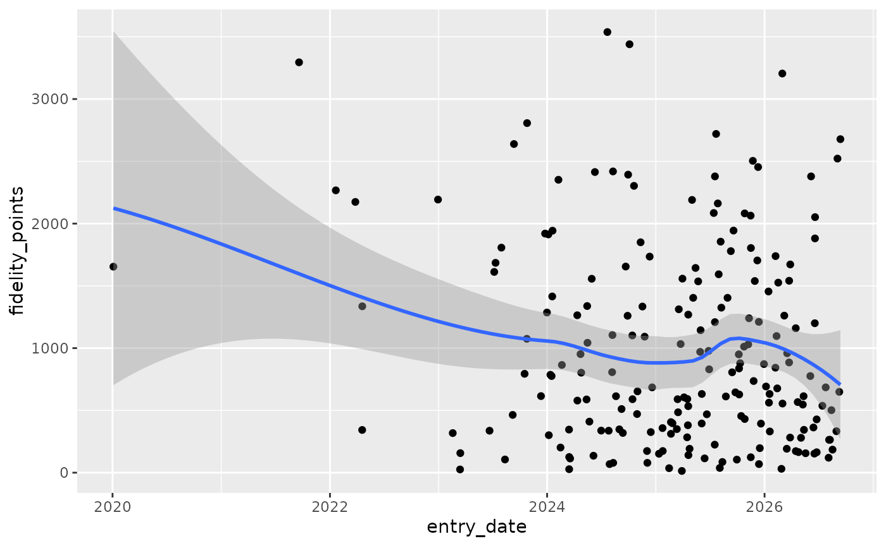
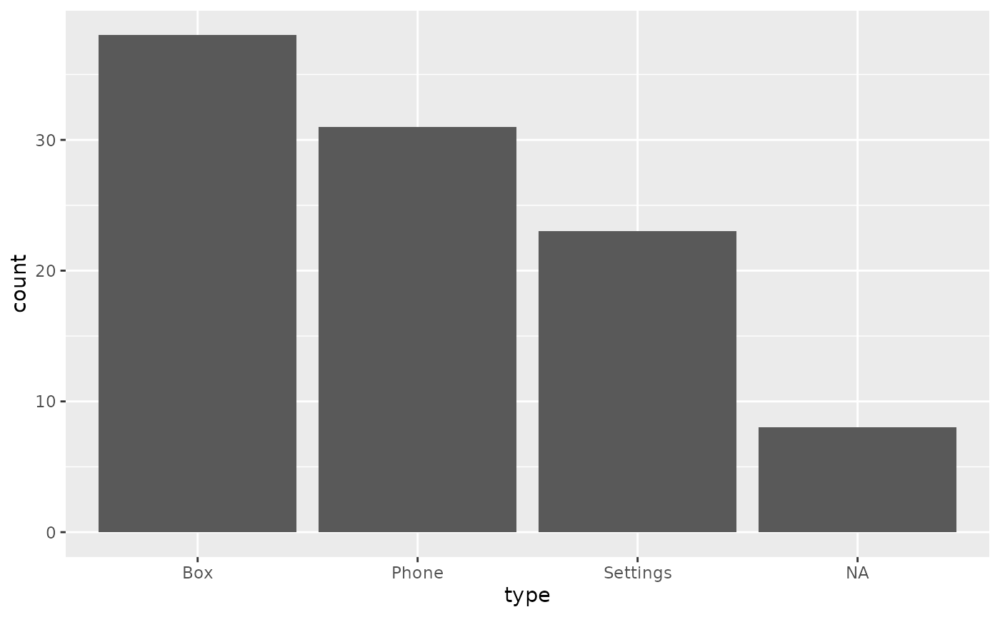
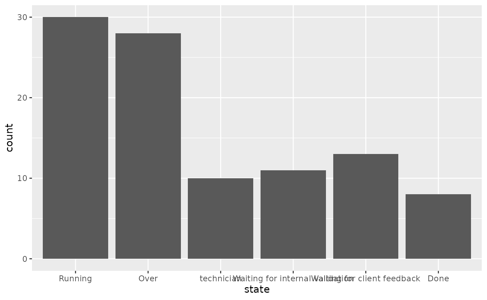
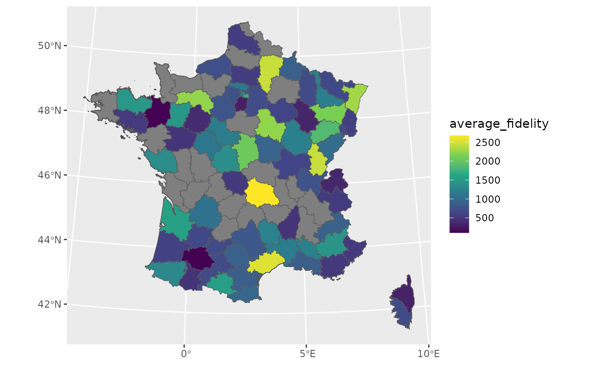
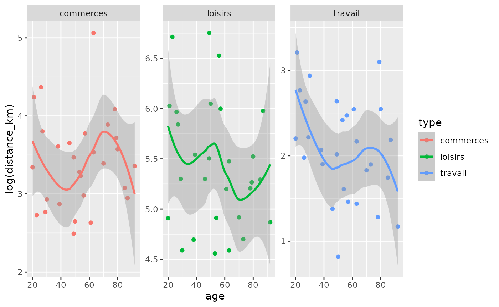

# fakir examples

``` r

library(fakir)
library(dplyr)
library(ggplot2)
library(sf)
```

## Fake client database

The database fakes an after-sale client database for a Phone company.
There is:

- a client database with all characteristics of the clients.

- a ticket database which contains all calls to the after-sale service
  of some clients having problems

- Ticket centered dataset with already joined client characteristics

``` r

fake_ticket_client(vol = 10)
#> old-style crs object detected; please recreate object with a recent sf::st_crs()
#> # A tibble: 10 × 25
#>    ref           num_client first    last  job     age region id_dpt departement
#>    <chr>         <chr>      <chr>    <chr> <chr> <dbl> <chr>  <chr>  <chr>      
#>  1 DOSS-AMQN-002 79         Jovan    O'Ke… Gene…    22 Picar… 60     Oise       
#>  2 DOSS-NCKJ-010 69         Miss     Lean… Emer…    68 Rhône… 07     Ardèche    
#>  3 DOSS-GPBE-009 120        Odell    Stok… Engi…    24 Poito… 86     Vienne     
#>  4 DOSS-GRLN-001 31         Loren    Lars… NA       NA Île-d… 78     Yvelines   
#>  5 DOSS-LEPJ-004 59         Maybelle Maye… Furt…    18 Aquit… 24     Dordogne   
#>  6 DOSS-DUCL-005 118        Jamarion Ober… Engi…    18 NA     33     Gironde    
#>  7 DOSS-OCED-003 77         Lee      Scha… Admi…    NA NA     16     Charente   
#>  8 DOSS-KXSJ-007 65         Demetric Auer  Cont…    21 Champ… 51     Marne      
#>  9 DOSS-UITD-006 141        Wilfrid  Harv… Educ…    53 Rhône… 69     Rhône      
#> 10 DOSS-SHKL-008 182        Addyson  Nien… Earl…    65 NA     40     Landes     
#> # ℹ 16 more variables: cb_provider <chr>, name <chr>, entry_date <dttm>,
#> #   fidelity_points <dbl>, priority_encoded <dbl>, priority <fct>,
#> #   timestamp <date>, year <dbl>, month <dbl>, day <int>, supported <chr>,
#> #   supported_encoded <int>, type <chr>, type_encoded <int>, state <fct>,
#> #   source_call <fct>
```

- Separate tickets and client databases

``` r

tickets_db <- fake_ticket_client(vol = 100, split = TRUE)
#> old-style crs object detected; please recreate object with a recent sf::st_crs()
tickets_db
#> $clients
#> # A tibble: 200 × 14
#>    num_client first   last     job     age region id_dpt departement cb_provider
#>  * <chr>      <chr>   <chr>    <chr> <dbl> <chr>  <chr>  <chr>       <chr>      
#>  1 1          Solomon Heaney   Civi…    53 Champ… 08     Ardennes    Diners Clu…
#>  2 2          Karma   William… Scie…    81 NA     22     Côtes-d'Ar… VISA 13 di…
#>  3 3          Press   Kulas    Anim…    NA Midi-… 12     Aveyron     NA         
#>  4 4          Laken   McDermo… NA       NA Prove… 05     Hautes-Alp… NA         
#>  5 5          Sydnie  Jaskols… Hort…    30 Champ… 52     Haute-Marne NA         
#>  6 6          Clayton Runolfs… Comm…    NA NA     01     Ain         Diners Clu…
#>  7 7          Roberta Purdy-W… Fina…    60 NA     85     Vendée      NA         
#>  8 8          Dr.     RonaldM… Astr…    30 Pays … 85     Vendée      NA         
#>  9 9          Miss    Alondra… Occu…    18 Midi-… 82     Tarn-et-Ga… Diners Clu…
#> 10 10         Vernice Ondrick… Clin…    19 NA     68     Haut-Rhin   NA         
#> # ℹ 190 more rows
#> # ℹ 5 more variables: name <chr>, entry_date <dttm>, fidelity_points <dbl>,
#> #   priority_encoded <dbl>, priority <fct>
#> 
#> $tickets
#> # A tibble: 100 × 10
#>    ref            num_client  year month   day timestamp  supported type   state
#>    <chr>          <chr>      <dbl> <dbl> <int> <date>     <chr>     <chr>  <fct>
#>  1 DOSS-GFEL-0028 1           2020     5    25 2020-05-25 No        Box    Runn…
#>  2 DOSS-UWYV-0016 22          2024     3    17 2024-03-17 No        Box    Wait…
#>  3 DOSS-DKFC-0073 9           2024     4    21 2024-04-21 No        Box    Runn…
#>  4 DOSS-SAYJ-0047 8           2024     5     5 2024-05-05 No        Phone  Over 
#>  5 DOSS-GSMZ-0080 30          2024     5    23 2024-05-23 Yes       Box    Over 
#>  6 DOSS-UIOZ-0085 10          2024     6     4 2024-06-04 Yes       Setti… tech…
#>  7 DOSS-DSMI-0065 37          2024     7     2 2024-07-02 No        Box    tech…
#>  8 DOSS-JOYV-0029 37          2024     8    22 2024-08-22 No        Box    Over 
#>  9 DOSS-WPSG-0013 24          2024     8    29 2024-08-29 No        Setti… Over 
#> 10 DOSS-NHFG-0036 12          2024     9    15 2024-09-15 No        Setti… Over 
#> # ℹ 90 more rows
#> # ℹ 1 more variable: source_call <fct>
```

- Explore datasets

``` r

ggplot(tickets_db$clients) +
  aes(x = entry_date, y = fidelity_points) +
  geom_point() +
  geom_smooth()
#> `geom_smooth()` using method = 'loess' and formula = 'y ~ x'
```



``` r

ggplot(tickets_db$tickets) +
  aes(x = type) +
  geom_bar()
```



``` r

ggplot(tickets_db$tickets) +
  aes(x = state) +
  geom_bar()
```



- Join with internal {sf} spatial dataset `fra_sf`. *{sf} package must
  be loaded.*

``` r

clients_map <- tickets_db$clients %>%
  group_by(id_dpt) %>%
  summarise(
    number_of_clients = n(),
    average_fidelity = mean(fidelity_points, na.rm = TRUE)
  ) %>%
  full_join(fra_sf, by = "id_dpt") %>%
  st_sf()
#> old-style crs object detected; please recreate object with a recent sf::st_crs()

ggplot(clients_map) +
  geom_sf(aes(fill = average_fidelity)) +
  scale_fill_viridis_c() +
  coord_sf(
    crs = 2154,
    datum = 4326
  )
```



### Fake products

- Create a fake dataset of connected wearables

``` r

count(
  fake_products(10),
  category
)
#> # A tibble: 7 × 2
#>   category             n
#>   <chr>            <int>
#> 1 Awesome              2
#> 2 Fitness              1
#> 3 Gaming               1
#> 4 Industrial           1
#> 5 Lifestyle            1
#> 6 Medical              3
#> 7 Pets and Animals     1
```

### Fake website visits

``` r

fake_visits(
  from = "2017-01-01",
  to = "2017-01-31"
)
#> # A tibble: 31 × 8
#>    timestamp   year month   day  home about  blog contact
#>  * <date>     <dbl> <dbl> <int> <int> <int> <int>   <int>
#>  1 2017-01-01  2017     1     1   369   220   404     210
#>  2 2017-01-02  2017     1     2   159   250   414     490
#>  3 2017-01-03  2017     1     3   436   170   498     456
#>  4 2017-01-04  2017     1     4    NA   258   526     392
#>  5 2017-01-05  2017     1     5   362    NA   407     291
#>  6 2017-01-06  2017     1     6   245   145   576      90
#>  7 2017-01-07  2017     1     7    NA    NA   484     167
#>  8 2017-01-08  2017     1     8   461   103   441      NA
#>  9 2017-01-09  2017     1     9   337   113   673     379
#> 10 2017-01-10  2017     1    10    NA   169   308     139
#> # ℹ 21 more rows
```

### Fake questionnaire on mean of transport / goal

- All answers

``` r

fake_survey_answers(n = 10)
#> old-style crs object detected; please recreate object with a recent sf::st_crs()
#> # A tibble: 30 × 12
#>    id_individu   age sexe  region                 id_departement nom_departement
#>    <chr>       <int> <chr> <chr>                  <chr>          <chr>          
#>  1 ID-NYDZ-010    NA NA    Provence-Alpes-Côte d… 83             Var            
#>  2 ID-NYDZ-010    NA NA    Provence-Alpes-Côte d… 83             Var            
#>  3 ID-NYDZ-010    NA NA    Provence-Alpes-Côte d… 83             Var            
#>  4 ID-PWLB-009    71 F     Centre                 41             Loir-et-Cher   
#>  5 ID-PWLB-009    71 F     Centre                 41             Loir-et-Cher   
#>  6 ID-PWLB-009    71 F     Centre                 41             Loir-et-Cher   
#>  7 ID-NMQG-001    42 M     Champagne-Ardenne      51             Marne          
#>  8 ID-NMQG-001    42 M     Champagne-Ardenne      51             Marne          
#>  9 ID-NMQG-001    42 M     Champagne-Ardenne      51             Marne          
#> 10 ID-RJXN-002    71 O     Île-de-France          78             Yvelines       
#> # ℹ 20 more rows
#> # ℹ 6 more variables: question_date <dttm>, year <dbl>, type <chr>,
#> #   distance_km <dbl>, transport <fct>, temps_trajet_en_heures <dbl>
```

- Separate individuals and their answers

``` r

fake_survey_answers(n = 10, split = TRUE)
#> old-style crs object detected; please recreate object with a recent sf::st_crs()
#> $individus
#> # A tibble: 10 × 8
#>    id_individu   age sexe  region                 id_departement nom_departement
#>    <chr>       <int> <chr> <chr>                  <chr>          <chr>          
#>  1 ID-NYDZ-010    NA NA    Bretagne               29             Finistère      
#>  2 ID-PWLB-009    71 F     Provence-Alpes-Côte d… 06             Alpes-Maritimes
#>  3 ID-NMQG-001    42 M     Auvergne               03             Allier         
#>  4 ID-RJXN-002    71 O     Provence-Alpes-Côte d… 13             Bouches-du-Rhô…
#>  5 ID-MROK-007    41 M     Bourgogne              89             NA             
#>  6 ID-VMKS-004    33 O     Rhône-Alpes            01             Ain            
#>  7 ID-XEMZ-003    81 O     Midi-Pyrénées          32             Gers           
#>  8 ID-EUDQ-005    44 M     Midi-Pyrénées          12             Aveyron        
#>  9 ID-DCIZ-008    92 O     Pays de la Loire       49             Maine-et-Loire 
#> 10 ID-KPUS-006    57 O     Midi-Pyrénées          32             Gers           
#> # ℹ 2 more variables: question_date <dttm>, year <dbl>
#> 
#> $answers
#> # A tibble: 30 × 5
#>    id_individu type      distance_km transport temps_trajet_en_heures
#>    <chr>       <chr>           <dbl> <fct>                      <dbl>
#>  1 ID-NYDZ-010 travail         12.2  voiture                     0.15
#>  2 ID-NYDZ-010 commerces        9.61 bus                         1.01
#>  3 ID-NYDZ-010 loisirs        549.   avion                       0.27
#>  4 ID-PWLB-009 travail         11.9  voiture                     0.14
#>  5 ID-PWLB-009 commerces       27.4  voiture                     0.34
#>  6 ID-PWLB-009 loisirs        210.   train                       0.42
#>  7 ID-NMQG-001 travail          2.38 velo                        0.43
#>  8 ID-NMQG-001 commerces       14.9  voiture                     0.18
#>  9 ID-NMQG-001 loisirs        446.   train                       0.89
#> 10 ID-RJXN-002 travail          6.18 mobylette                   0.75
#> # ℹ 20 more rows
```

### fake transport use

``` r

answers <- fake_survey_answers(n = 30)
#> old-style crs object detected; please recreate object with a recent sf::st_crs()
answers
#> # A tibble: 90 × 12
#>    id_individu   age sexe  region        id_departement nom_departement  
#>    <chr>       <int> <chr> <chr>         <chr>          <chr>            
#>  1 ID-MROK-007    NA M     NA            51             NA               
#>  2 ID-MROK-007    NA M     NA            51             NA               
#>  3 ID-MROK-007    NA M     NA            51             NA               
#>  4 ID-NYDZ-010    49 M     Île-de-France 93             Seine-Saint-Denis
#>  5 ID-NYDZ-010    49 M     Île-de-France 93             Seine-Saint-Denis
#>  6 ID-NYDZ-010    49 M     Île-de-France 93             Seine-Saint-Denis
#>  7 ID-HXOG-015    50 M     NA            50             Manche           
#>  8 ID-HXOG-015    50 M     NA            50             Manche           
#>  9 ID-HXOG-015    50 M     NA            50             Manche           
#> 10 ID-MZNB-024    70 F     Midi-Pyrénées 12             Aveyron          
#> # ℹ 80 more rows
#> # ℹ 6 more variables: question_date <dttm>, year <dbl>, type <chr>,
#> #   distance_km <dbl>, transport <fct>, temps_trajet_en_heures <dbl>

ggplot(answers) +
  aes(age, log(distance_km), colour = type) +
  geom_point() +
  geom_smooth() +
  facet_wrap(~type, scales = "free_y")
#> `geom_smooth()` using method = 'loess' and formula = 'y ~ x'
#> Warning: Removed 6 rows containing non-finite outside the scale range
#> (`stat_smooth()`).
#> Warning: Removed 6 rows containing missing values or values outside the scale range
#> (`geom_point()`).
```


